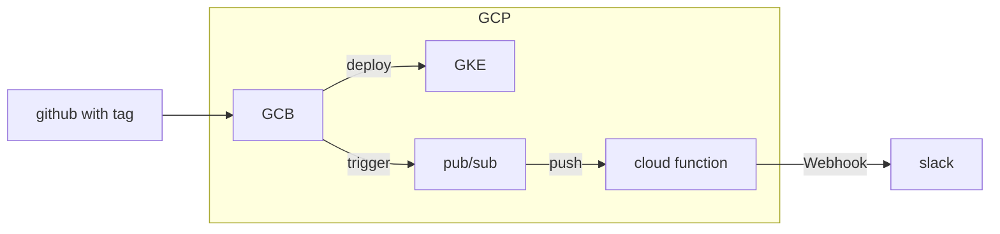

<head>

</head>

# 全体図
簡単そうなのでGoogleCloudBuild を使う．以下は全体図．

## service
基本的にサービスのデプロイはtagにサービス名(ディレクトリ名)をつけてpushするとビルドが走る
## google cloud functions
タグにfunction の名前をつけてpushすると更新される

## Helm3-alpha
helm 以下のディレクトリにチャートが揃っており，
互いに共通の変数がディレクトリ直下の`values.yaml`にしまわれている．
チャートごとの変数はそれぞれのチャートのディレクトリ以下にしまわれている．

チャート名やリリース名はkubeのリソース名に含まれるので，`lowercase`で
`-`か`.`を使うようにする．

values.yamlを暗号化して復号化する際の権限の付与が `terraform` でよくわからんかったので手動で付与

`helm upgrade` でvalueが変わらなかったので，`helm template` で生成してから `k apply -f -` でやる方向で行く．

### dev
### prd

### Tips
#### `helm upgrade --install`
`release` が存在しなければ `install` をしてくれるので `kubectl apply` と同じと見た
#### `upgrade --set hoge=hogehoge` ではなにもやらない場合がある
**バグだった**  
今の所一回消す必要あり  
面倒なので `helm tempalte | kubectl apply -f -` 使う．
>同じバージョンで `image tag` を変えても `pod image tag` は変わらなかった．
`deployments.apps` の `image tag` も変わっていなかった．
`deployments.apps` は更新されない模様．
`helm history [release name]` には新しく追加されている．  
[詳しく書いてくれている](<https://medium.com/@kcatstack/understand-helm-upgrade-flags-reset-values-reuse-values-6e58ac8f127e>
)
同じバージョンで `--recreate-pod` を指定しても `image tag` は変わらなかった
