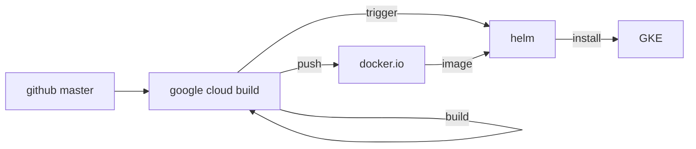

<head>

</head>

# Overview
簡単そうなのでgoogle cloud build を使う．以下は全体図．

## Helm 
helm 以下のディレクトリにチャートが揃っており，
互いに共通の変数がディレクトリ直下の`values.yaml`にしまわれている．
チャートごとの変数はそれぞれのチャートのディレクトリ以下にしまわれている．

チャート名やリリース名はkubeのリソース名に含まれるので，`lowercase`で
`-`か`.`を使うようにする．

### dev
### prd
