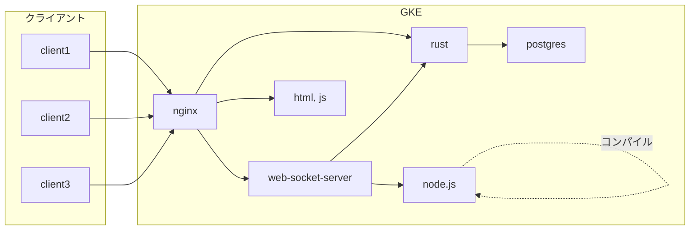

# ドキュメント
## 全体図

## 共通API
👉 [Socket Event Spec (Plugin)](events/plugins.md)

👉 [Socket Event Spec (Other)](events/others.md)

## クライアント
### 画面構成
👉 [View](view.md)

### 仕様 generated by Typedoc
👉 [Client docs](client/index.html)

### プラグインの仕様
👉 [I-Plugin Specs](other/plugin-spec.md)

## サーバー
### 構成
👉 [Server docs](server/main.md)

### ci-cd
👉 [ci-cd の構成](ci-cd/main.md)
